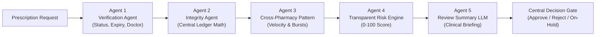

# 🛡️ MEDLOCK AI — Project Overview & Master Summary

**MEDLOCK AI** is an Agentic Cross-Pharmacy Prescription Integrity System designed for hackathons, clinical demonstrations, and healthcare integrity research.

---

## 📌 Executive Summary

- **Project Name:** MEDLOCK AI
- **Subtitle:** Agentic Cross-Pharmacy Prescription Integrity System
- **Core Purpose:** Prevent patients from acquiring more prescription-restricted medicine than authorized across multiple participating physical and online pharmacies.
- **Main Innovation:** Merging **hard deterministic database ledger rules** ($\text{Remaining} = \text{Authorized} - \sum \text{Dispensed}$) with an **Agentic AI Layer** that monitors cross-pharmacy velocity, detects suspicious burst patterns, scores risk transparently, and generates grounded clinical briefings for human pharmacists.
- **Human-In-The-Loop (HITL):** An LLM **never** decides whether medicine can be dispensed. High-risk or anomalous requests are automatically placed `ON_HOLD` and routed to authorized pharmacists for review.

---

## 🎯 The Core Problem

In disconnected healthcare ecosystems, pharmacies operate in isolated silos:

1. **Physical Pharmacies:** Pharmacy A does not know what was dispensed at Pharmacy B.
2. **Pharmacy Chains:** Chain X cannot see records from Chain Y.
3. **Online Pharmacies:** Digital direct-to-consumer pharmacies operate without cross-network synchronization.

### Real-World Vulnerability Example
- **Prescription:** Demo Restricted Medicine X
- **Authorized Quantity:** 30 tablets
- **Purchase 1 (10:00):** Pharmacy A $\rightarrow$ 10 tablets approved (Remaining: 20)
- **Purchase 2 (11:00):** Pharmacy B $\rightarrow$ requests 10 tablets $\rightarrow$ **Approved** (Remaining: 10)
- **Purchase 3 (12:00):** Pharmacy C $\rightarrow$ requests 20 tablets $\rightarrow$ **Blocked!** (Only 10 remain, requested 20 exceeds remaining).

In legacy disconnected systems, Purchase 3 would succeed because Pharmacy C has no access to previous records. **MEDLOCK AI prevents this 100% deterministically.**

---

## ⚡ Key System Architecture Highlights

1. **Centralized Dispensing Ledger:** Real-time atomic balance queries across all network pharmacies.
2. **5-Agent Controlled Pipeline:**
   - **Agent 1 (Verification):** Deterministically validates prescription status, expiry date, physician license, and patient identity.
   - **Agent 2 (Integrity):** Computes exact ledger balance ($\text{authorized} - \sum \text{dispensed}$) and blocks over-dispensing.
   - **Agent 3 (Cross-Pharmacy Pattern):** Analyzes multi-provider velocity, 2h/24h rolling windows, and rapid switching between physical and online channels.
   - **Agent 4 (Risk Engine):** Computes transparent weighted risk score ($0 - 100$) mapped to `LOW`, `MEDIUM`, `HIGH`, `CRITICAL`.
   - **Agent 5 (Review Summary):** Synthesizes grounded natural language briefings for human reviewers.
3. **Tamper-Evident SHA-256 Audit Trail:** Every event is chained cryptographically to the preceding block hash.
4. **Interactive AI Decision Timeline:** Visual stepper showing step-by-step agent execution for judges.

---

## 👥 Supported Roles & Portals

| Role | Access URL | Key Functionalities |
| :--- | :--- | :--- |
| **Patient** | `/patient` | View active digital prescriptions, remaining quantity gauges, multi-pharmacy dispensing history, and safety warnings. |
| **Doctor** | `/doctor` | Issue multi-medicine prescriptions with cryptographic signatures, generate QR codes, and cancel prescriptions. |
| **Pharmacy** | `/pharmacy` | Scan prescription QR codes, trigger real-time AI evaluation, execute dispensing, and decrement central ledger. |
| **Admin / Reviewer** | `/admin` | Triage held transactions, review clinical summaries, commit human overrides, and inspect SHA-256 audit logs. |
| **Judge Arena** | `/demo` | 1-click interactive execution of Scenarios 1–4 with live decision timeline and raw JSON inspector. |

---

## 🧪 Current Verification Status

- **Backend Test Suite:** 7/7 tests passing (`pytest` on Agent 1, Agent 2, Agent 3, Agent 4, and Scenarios 1-4).
- **Frontend Build:** Next.js 14 production build compiled with 0 errors across all 11 routes.
- **Seed Fixtures:** Pre-configured with 5 Patients, 2 Doctors, 4 Physical Pharmacies, 1 Online Pharmacy, and 5 demo prescriptions.

---

## 📖 Document Navigation Index

Each aspect of MEDLOCK AI is detailed in separate markdown files in this `.md/` directory:

1. [System Architecture & Design](file:///D:/gvp%20codes/MEDLOCK%20AI%20-%20HOJATHON/.md/01_ARCHITECTURE_AND_DESIGN.md)
2. [Database Schema & Ledger Design](file:///D:/gvp%20codes/MEDLOCK%20AI%20-%20HOJATHON/.md/02_DATABASE_AND_LEDGER_SCHEMA.md)
3. [Multi-Agent AI System Specification](file:///D:/gvp%20codes/MEDLOCK%20AI%20-%20HOJATHON/.md/03_MULTI_AGENT_AI_SYSTEM.md)
4. [Complete REST API Reference](file:///D:/gvp%20codes/MEDLOCK%20AI%20-%20HOJATHON/.md/04_API_REFERENCE.md)
5. [Demo Scenarios & Test Suite](file:///D:/gvp%20codes/MEDLOCK%20AI%20-%20HOJATHON/.md/05_DEMO_SCENARIOS_AND_TESTING.md)
6. [Frontend Portals & UI Components](file:///D:/gvp%20codes/MEDLOCK%20AI%20-%20HOJATHON/.md/06_FRONTEND_PORTALS_AND_UI.md)
7. [Setup, Deployment & Changelog Guide](file:///D:/gvp%20codes/MEDLOCK%20AI%20-%20HOJATHON/.md/07_SETUP_AND_CHANGELOG_GUIDE.md)
