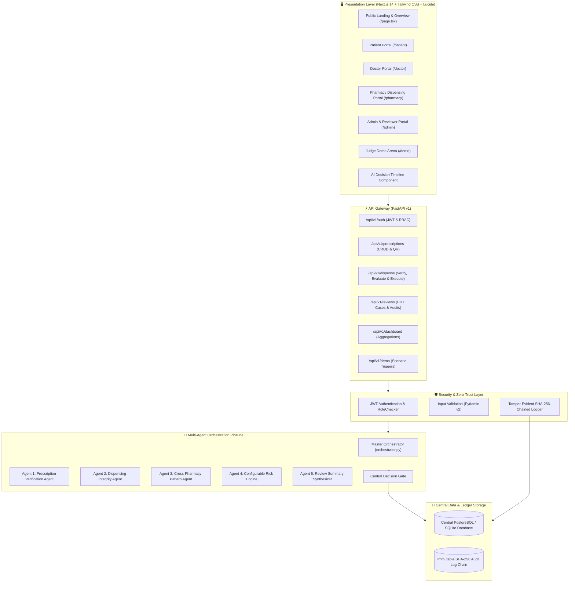
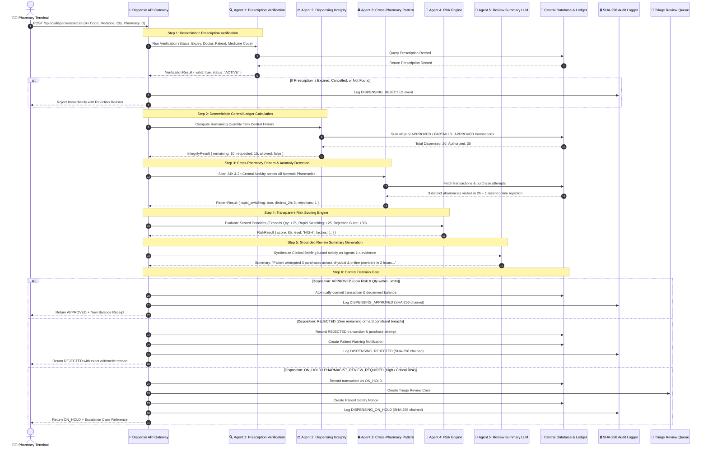

# 🏛️ MEDLOCK AI — System Architecture & Design

This document details the architectural principles, component interactions, data flows, and security model of **MEDLOCK AI**.

---

## 1. System Architecture Diagram

---

## 2. End-to-End Dispensing Sequence Diagram

---

## 3. Core Architectural Principles

### 1. Separation of Deterministic Rules from AI Reasoning
- **Hard Rules:** Mathematical limits, prescription validity dates, license validations, and quantity deductions are executed via deterministic code and relational database queries.
- **AI Role:** AI agents analyze behavioral velocity, provider hopping, channel switching, score risk transparently, and generate natural language summaries for clinicians. An LLM **never** determines quantity allowance.

### 2. Zero-Trust Central Dispensing Ledger
Every participating pharmacy (physical chain, independent, or online) queries the central ledger dynamically. No pharmacy relies on local cache or patient self-declaration.

### 3. Human-In-The-Loop (HITL) Guardrails
High-risk cases (Risk Score $\ge 50$) trigger an automated hold state. Automated dispensing is suspended, and the case is queued in the Admin / Reviewer portal for clinical override (`APPROVED_OVERRIDE`, `CONFIRMED_FRAUD`, `DISMISSED`).

### 4. Cryptographic Chained Audit Logging
To prevent audit log tampering, each log record contains:
$$\text{sha256\_hash} = \text{SHA-256}(\text{prev\_hash} \parallel \text{timestamp} \parallel \text{event\_type} \parallel \text{actor\_user\_id} \parallel \text{target\_entity} \parallel \text{details\_json})$$
This guarantees an immutable tamper-evident chain from the genesis block onward.
