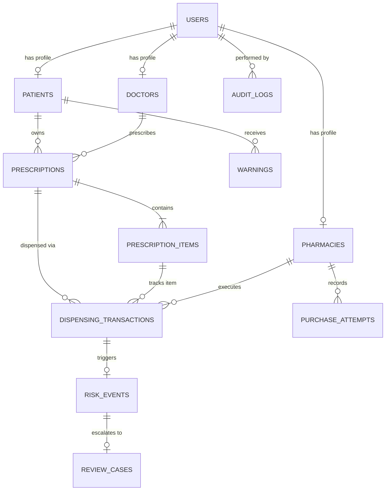

# 💾 MEDLOCK AI — Database & Ledger Schema Specification

This document provides the complete database entity-relationship schema, field definitions, indexing strategy, and ledger calculation rules implemented in MEDLOCK AI.

---

## 1. Entity-Relationship Diagram (ERD)

---

## 2. Table Definitions

### 1. `users`
Central authentication and identity table with role-based access.

| Column | Type | Constraints | Description |
| :--- | :--- | :--- | :--- |
| `id` | VARCHAR(36) | PK, UUID | Unique user identifier |
| `email` | VARCHAR(255) | UNIQUE, INDEX, NOT NULL | Account email (case-insensitive) |
| `hashed_password` | VARCHAR(255) | NOT NULL | Bcrypt hashed password |
| `full_name` | VARCHAR(255) | NOT NULL | Individual or facility name |
| `role` | VARCHAR(50) | INDEX, NOT NULL | Role: `PATIENT`, `DOCTOR`, `PHARMACY`, `ADMIN` |
| `phone` | VARCHAR(50) | NULLABLE | Contact telephone |
| `is_active` | BOOLEAN | DEFAULT TRUE | Active account flag |
| `created_at` | DATETIME | DEFAULT UTC NOW | Account creation timestamp |

---

### 2. `patients`
Patient medical metadata and emergency contact details.

| Column | Type | Constraints | Description |
| :--- | :--- | :--- | :--- |
| `id` | VARCHAR(36) | PK, UUID | Unique patient identifier |
| `user_id` | VARCHAR(36) | FK (`users.id`), UNIQUE | Associated user account |
| `date_of_birth` | DATE | NULLABLE | Patient birthdate |
| `national_id_hash` | VARCHAR(64) | INDEX, NULLABLE | Anonymized SHA-256 national ID |
| `emergency_contact`| VARCHAR(100) | NULLABLE | Primary emergency contact |
| `blood_group` | VARCHAR(10) | NULLABLE | Blood typing (e.g. `O+`, `A-`) |
| `created_at` | DATETIME | DEFAULT UTC NOW | Record creation timestamp |

---

### 3. `doctors`
Physician licensing, verification, and institutional affiliations.

| Column | Type | Constraints | Description |
| :--- | :--- | :--- | :--- |
| `id` | VARCHAR(36) | PK, UUID | Unique doctor identifier |
| `user_id` | VARCHAR(36) | FK (`users.id`), UNIQUE | Associated user account |
| `license_number` | VARCHAR(100) | UNIQUE, INDEX, NOT NULL | State medical board license |
| `specialization` | VARCHAR(150) | NULLABLE | Medical specialty |
| `hospital_clinic_name` | VARCHAR(255) | NULLABLE | Primary hospital affiliation |
| `is_verified` | BOOLEAN | DEFAULT TRUE | Medical registry standing |
| `created_at` | DATETIME | DEFAULT UTC NOW | Registration timestamp |

---

### 4. `pharmacies`
Participating dispensing locations (physical chains, independents, online).

| Column | Type | Constraints | Description |
| :--- | :--- | :--- | :--- |
| `id` | VARCHAR(36) | PK, UUID | Unique pharmacy identifier |
| `user_id` | VARCHAR(36) | FK (`users.id`), UNIQUE | Associated user account |
| `pharmacy_name` | VARCHAR(255) | NOT NULL | Registered pharmacy name |
| `license_number` | VARCHAR(100) | UNIQUE, INDEX, NOT NULL | Pharmacy operational license |
| `pharmacy_type` | VARCHAR(50) | NOT NULL | `PHYSICAL_CHAIN`, `INDEPENDENT`, `ONLINE` |
| `address` | VARCHAR(255) | NULLABLE | Physical location or web portal URL |
| `is_active` | BOOLEAN | DEFAULT TRUE | Operational status flag |
| `created_at` | DATETIME | DEFAULT UTC NOW | Onboarding timestamp |

---

### 5. `prescriptions`
Digital prescription header with validity window, cryptographic signature, and QR code.

| Column | Type | Constraints | Description |
| :--- | :--- | :--- | :--- |
| `id` | VARCHAR(36) | PK, UUID | Unique prescription identifier |
| `prescription_code`| VARCHAR(50) | UNIQUE, INDEX, NOT NULL | Human-readable code (e.g. `RX-2026-8942A`) |
| `patient_id` | VARCHAR(36) | FK (`patients.id`), NOT NULL | Recipient patient |
| `doctor_id` | VARCHAR(36) | FK (`doctors.id`), NOT NULL | Prescribing physician |
| `issue_date` | DATETIME | DEFAULT UTC NOW | Prescription finalization date |
| `expiry_date` | DATETIME | NOT NULL | Legal expiration date |
| `status` | VARCHAR(50) | INDEX, DEFAULT 'ACTIVE' | `ACTIVE`, `EXHAUSTED`, `EXPIRED`, `CANCELLED`, `SUSPENDED` |
| `qr_code_data` | TEXT | NULLABLE | Base64 PNG data URL of verification QR |
| `digital_signature`| VARCHAR(512) | NULLABLE | Cryptographic SHA-256 doctor signature |
| `notes` | TEXT | NULLABLE | Clinical instructions and warnings |
| `created_at` | DATETIME | DEFAULT UTC NOW | Creation timestamp |
| `updated_at` | DATETIME | DEFAULT UTC NOW | Last update timestamp |

---

### 6. `prescription_items`
Individual medicines authorized under a prescription.

| Column | Type | Constraints | Description |
| :--- | :--- | :--- | :--- |
| `id` | VARCHAR(36) | PK, UUID | Unique item identifier |
| `prescription_id` | VARCHAR(36) | FK (`prescriptions.id`), NOT NULL | Parent prescription |
| `medicine_name` | VARCHAR(255) | NOT NULL | Brand or generic medicine name |
| `medicine_code` | VARCHAR(100) | NULLABLE | NDC or RxNorm identification code |
| `is_restricted` | BOOLEAN | DEFAULT TRUE | Controlled substance flag |
| `authorized_quantity` | INTEGER | NOT NULL | Total authorized tablet/unit count |
| `remaining_quantity` | INTEGER | NOT NULL | Denormalized balance counter |
| `dosage_instructions`| TEXT | NULLABLE | Intake instructions |
| `created_at` | DATETIME | DEFAULT UTC NOW | Timestamp |

---

### 7. `dispensing_transactions`
Atomic records of medicine dispensing attempts and commits.

| Column | Type | Constraints | Description |
| :--- | :--- | :--- | :--- |
| `id` | VARCHAR(36) | PK, UUID | Unique transaction identifier |
| `prescription_id` | VARCHAR(36) | FK (`prescriptions.id`), INDEX | Prescribed Rx reference |
| `prescription_item_id` | VARCHAR(36) | FK (`prescription_items.id`) | Specific medicine item |
| `pharmacy_id` | VARCHAR(36) | FK (`pharmacies.id`), INDEX | Dispensing pharmacy location |
| `requested_quantity`| INTEGER | NOT NULL | Quantity requested by patient |
| `approved_quantity` | INTEGER | DEFAULT 0 | Quantity actually approved & released |
| `remaining_before` | INTEGER | NOT NULL | Balance before transaction |
| `remaining_after` | INTEGER | NOT NULL | Balance after transaction |
| `status` | VARCHAR(50) | INDEX, NOT NULL | `APPROVED`, `PARTIALLY_APPROVED`, `REJECTED`, `ON_HOLD`, `PHARMACIST_REVIEW_REQUIRED` |
| `rejection_reason` | TEXT | NULLABLE | Explanation if denied |
| `transaction_timestamp` | DATETIME | INDEX, DEFAULT UTC NOW | Execution timestamp |
| `integrity_hash` | VARCHAR(64) | NULLABLE | Cryptographic SHA-256 signature |

---

### 8. `purchase_attempts`
High-frequency attempt log used by Agent 3 for velocity and burst analysis.

| Column | Type | Constraints | Description |
| :--- | :--- | :--- | :--- |
| `id` | VARCHAR(36) | PK, UUID | Unique attempt identifier |
| `prescription_id` | VARCHAR(36) | FK (`prescriptions.id`), INDEX | Target prescription |
| `pharmacy_id` | VARCHAR(36) | FK (`pharmacies.id`), INDEX | Attempted pharmacy location |
| `requested_quantity`| INTEGER | NOT NULL | Units requested |
| `attempt_timestamp`| DATETIME | INDEX, DEFAULT UTC NOW | UTC timestamp |
| `outcome` | VARCHAR(50) | NOT NULL | `APPROVED`, `REJECTED`, `ON_HOLD` |
| `ip_address` | VARCHAR(45) | NULLABLE | Origin IP (for online purchases) |

---

### 9. `risk_events`
Evaluated risk assessments generated by Agent 4.

| Column | Type | Constraints | Description |
| :--- | :--- | :--- | :--- |
| `id` | VARCHAR(36) | PK, UUID | Unique risk event identifier |
| `transaction_id` | VARCHAR(36) | FK (`dispensing_transactions.id`) | Associated transaction |
| `prescription_id` | VARCHAR(36) | FK (`prescriptions.id`) | Prescription reference |
| `patient_id` | VARCHAR(36) | FK (`patients.id`) | Patient reference |
| `risk_score` | INTEGER | NOT NULL | Score between `0` and `100` |
| `risk_level` | VARCHAR(50) | NOT NULL | `LOW`, `MEDIUM`, `HIGH`, `CRITICAL` |
| `factors_json` | JSON | NULLABLE | Scored factor breakdown array |
| `agent_summary` | TEXT | NULLABLE | Agent 5 clinical summary |
| `created_at` | DATETIME | DEFAULT UTC NOW | Assessment timestamp |

---

### 10. `warnings`
Patient-facing alerts regarding quantity restrictions or held transactions.

| Column | Type | Constraints | Description |
| :--- | :--- | :--- | :--- |
| `id` | VARCHAR(36) | PK, UUID | Unique alert identifier |
| `patient_id` | VARCHAR(36) | FK (`patients.id`), INDEX | Alert recipient |
| `prescription_id` | VARCHAR(36) | FK (`prescriptions.id`), NULLABLE| Associated Rx |
| `severity` | VARCHAR(50) | DEFAULT 'WARNING' | `INFO`, `WARNING`, `CRITICAL` |
| `title` | VARCHAR(255) | NOT NULL | Alert title |
| `message` | TEXT | NOT NULL | Alert body |
| `is_read` | BOOLEAN | DEFAULT FALSE | Patient read receipt |
| `created_at` | DATETIME | DEFAULT UTC NOW | Timestamp |

---

### 11. `review_cases`
Triage cases escalated for Human-in-the-loop (HITL) pharmacist resolution.

| Column | Type | Constraints | Description |
| :--- | :--- | :--- | :--- |
| `id` | VARCHAR(36) | PK, UUID | Unique case identifier |
| `case_number` | VARCHAR(50) | UNIQUE, INDEX, NOT NULL | Case reference (e.g. `CASE-2026-0012`) |
| `risk_event_id` | VARCHAR(36) | FK (`risk_events.id`), UNIQUE | Triggering risk event |
| `prescription_id` | VARCHAR(36) | FK (`prescriptions.id`) | Prescription reference |
| `patient_id` | VARCHAR(36) | FK (`patients.id`) | Patient reference |
| `status` | VARCHAR(50) | INDEX, DEFAULT 'PENDING' | `PENDING`, `UNDER_REVIEW`, `APPROVED_OVERRIDE`, `CONFIRMED_FRAUD`, `DISMISSED` |
| `reviewer_id` | VARCHAR(36) | FK (`users.id`), NULLABLE | Pharmacist who resolved case |
| `ai_summary` | TEXT | NULLABLE | Agent 5 briefing |
| `reviewer_notes` | TEXT | NULLABLE | Human clinician clinical notes |
| `resolution_timestamp` | DATETIME | NULLABLE | Resolution timestamp |
| `created_at` | DATETIME | DEFAULT UTC NOW | Escalation timestamp |

---

### 12. `audit_logs`
Cryptographically chained tamper-evident event ledger.

| Column | Type | Constraints | Description |
| :--- | :--- | :--- | :--- |
| `id` | VARCHAR(36) | PK, UUID | Unique log entry identifier |
| `event_type` | VARCHAR(100) | INDEX, NOT NULL | e.g. `DISPENSING_APPROVED`, `REVIEW_CASE_RESOLVED` |
| `actor_user_id` | VARCHAR(36) | FK (`users.id`), NULLABLE | User who executed action |
| `actor_role` | VARCHAR(50) | NULLABLE | Role of the actor |
| `target_entity` | VARCHAR(100) | NOT NULL | Modified database entity |
| `target_id` | VARCHAR(36) | NULLABLE | Primary key of modified entity |
| `details_json` | JSON | NULLABLE | Key parameters & payload |
| `prev_hash` | VARCHAR(64) | NULLABLE | SHA-256 hash of previous log entry |
| `sha256_hash` | VARCHAR(64) | INDEX, NOT NULL | Current entry cryptographic hash |
| `created_at` | DATETIME | INDEX, DEFAULT UTC NOW | Log timestamp |

---

## 3. Central Ledger Calculation Logic

The fundamental rule of the central dispensing ledger:

$$\text{dispensed\_quantity} = \sum_{\substack{t \in \text{transactions} \\ t.\text{status} \in \{\text{'APPROVED'}, \text{'PARTIALLY\_APPROVED'}\}}} t.\text{approved\_quantity}$$

$$\text{remaining\_quantity} = \max(0, \text{authorized\_quantity} - \text{dispensed\_quantity})$$

$$\text{allowed} = (\text{requested\_quantity} \le \text{remaining\_quantity}) \land (\text{remaining\_quantity} > 0)$$

$$\text{max\_permissible\_quantity} = \min(\text{requested\_quantity}, \text{remaining\_quantity})$$

This query runs with database row-level locking during execution to eliminate race conditions between simultaneous requests.
