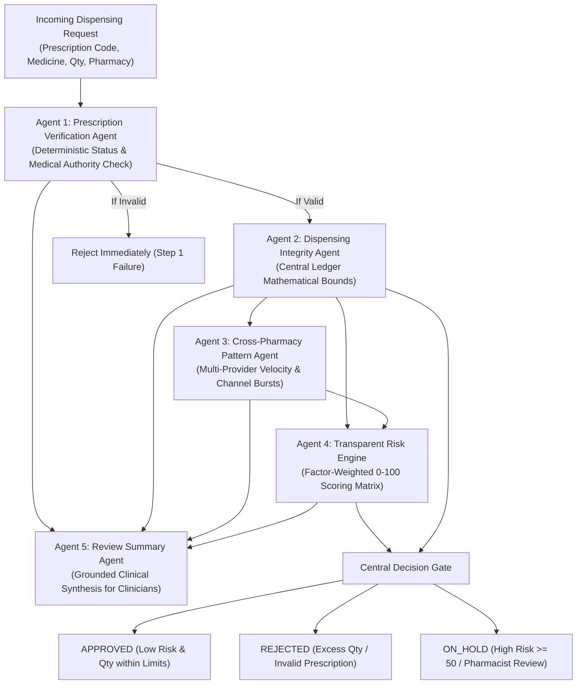

# 🤖 MEDLOCK AI — Multi-Agent AI System Specification

This document specifies the internal workings, input/output contracts, heuristic algorithms, and risk scoring matrices of the 5 controlled agents powering MEDLOCK AI.

---

## 1. Multi-Agent Pipeline Overview



---

## 2. Detailed Agent Specifications

### Agent 1: Prescription Verification Agent
- **File:** [`backend/app/agents/agent_verification.py`](file:///D:/gvp%20codes/MEDLOCK%20AI%20-%20HOJATHON/backend/app/agents/agent_verification.py)
- **Role:** Deterministic Medical Authority & Prescription Integrity
- **Algorithm & Execution Steps:**
  1. Lookup prescription by code or QR payload in the central database.
  2. Confirm prescription exists (if not, return `NOT_FOUND`).
  3. Verify status equals `ACTIVE`. (Reject if `EXHAUSTED`, `EXPIRED`, `CANCELLED`, or `SUSPENDED`).
  4. Check expiration date: $\text{expiry\_date} \ge \text{current\_utc\_time}$.
  5. Confirm prescribing doctor has an active, verified medical license.
  6. Confirm patient identity matches registration records.
  7. Confirm requested medicine matches an authorized item code on the prescription.
- **Output Schema:**
```json
{
  "agent_name": "Prescription Verification Agent",
  "valid": true,
  "prescription_id": "84c1...",
  "prescription_code": "RX-2026-DEMO1",
  "prescription_status": "ACTIVE",
  "expiry_valid": true,
  "doctor_verified": true,
  "patient_verified": true,
  "medicine_match": true,
  "rejection_reason": null,
  "timestamp": "2026-09-12T10:00:00Z"
}
```

---

### Agent 2: Dispensing Integrity Agent
- **File:** [`backend/app/agents/agent_integrity.py`](file:///D:/gvp%20codes/MEDLOCK%20AI%20-%20HOJATHON/backend/app/agents/agent_integrity.py)
- **Role:** Deterministic Central Ledger Arithmetic
- **Algorithm & Execution Steps:**
  1. Query all prior transactions for this prescription item across the entire participating pharmacy network with status in `["APPROVED", "PARTIALLY_APPROVED"]`.
  2. Calculate total previously dispensed: $\sum \text{approved\_quantity}$.
  3. Calculate remaining balance: $\text{remaining} = \max(0, \text{authorized} - \text{dispensed})$.
  4. Mathematical check: $\text{allowed} = (\text{requested} \le \text{remaining}) \land (\text{remaining} > 0)$.
  5. Compute maximum permissible quantity: $\min(\text{requested}, \text{remaining})$.
- **Safety Note:** Zero LLM involvement. Mathematical guarantee against hallucinations.
- **Output Schema:**
```json
{
  "agent_name": "Dispensing Integrity Agent",
  "item_id": "item_uuid",
  "medicine_name": "Demo Restricted Medicine X",
  "authorized_quantity": 30,
  "dispensed_quantity": 10,
  "remaining_quantity": 20,
  "requested_quantity": 10,
  "allowed": true,
  "max_permissible_quantity": 10,
  "is_partial_possible": false,
  "reason": "Quantity request (10) is within remaining limit (20/30).",
  "timestamp": "2026-09-12T10:00:00Z"
}
```

---

### Agent 3: Cross-Pharmacy Pattern Agent
- **File:** [`backend/app/agents/agent_pattern.py`](file:///D:/gvp%20codes/MEDLOCK%20AI%20-%20HOJATHON/backend/app/agents/agent_pattern.py)
- **Role:** Behavioral Velocity & Cross-Channel Anomaly Detection
- **Algorithm & Execution Steps:**
  1. **Rolling 24h & 2h Windows:** Query all dispensing transactions and purchase attempts for the prescription across the entire network.
  2. **Rapid Switching:** Count distinct pharmacies accessed within a 2-hour window. If $\ge 2$, flag `rapid_provider_switching_detected = true`.
  3. **Multi-Provider Spike:** Count distinct pharmacies accessed within a 24-hour window. If $\ge 3$, flag multi-provider spike.
  4. **Hybrid Channel Burst:** Check if both online and brick-and-mortar pharmacies were accessed concurrently.
  5. **Rejection Burst:** Check if any purchase attempt was rejected in the past 48h, and whether a new attempt occurred within 30 minutes of a rejection (`burst_after_rejection_detected`).
- **Output Schema:**
```json
{
  "agent_name": "Cross-Pharmacy Pattern Agent",
  "distinct_pharmacies_24h": 3,
  "distinct_pharmacies_2h": 3,
  "online_pharmacy_accessed": true,
  "recent_rejected_attempts_48h": 1,
  "rapid_provider_switching_detected": true,
  "burst_after_rejection_detected": true,
  "anomaly_detected": true,
  "pattern_reasons": [
    "Rapid provider switching: 3 distinct pharmacies accessed within a 2-hour window.",
    "Hybrid channel pattern: Concurrent access between online and physical brick-and-mortar pharmacies.",
    "Immediate retry behavior: New purchase attempt submitted within 30 minutes of a rejected transaction."
  ],
  "timestamp": "2026-09-12T10:00:00Z"
}
```

---

### Agent 4: Configurable Transparent Risk Engine
- **File:** [`backend/app/agents/agent_risk_engine.py`](file:///D:/gvp%20codes/MEDLOCK%20AI%20-%20HOJATHON/backend/app/agents/agent_risk_engine.py)
- **Role:** Explainable Factor-Weighted Risk Scoring (0 to 100)
- **Configurable Scoring Weights:**

| Risk Factor | Trigger Condition | Penalty Score |
| :--- | :--- | :--- |
| `QUANTITY_EXCEEDS_REMAINING` | Requested quantity exceeds ledger balance | **+25 points** |
| `RAPID_PROVIDER_SWITCHING` | 2+ distinct pharmacies accessed in < 2 hours | **+25 points** |
| `MULTI_PROVIDER_24H` | 3+ distinct pharmacies accessed in < 24 hours | **+20 points** |
| `REPEATED_REJECTIONS` | 1+ rejected attempt recorded in past 48 hours | **+20 points** |
| `IMMEDIATE_RETRY_AFTER_DENIAL`| New attempt submitted < 30 minutes after rejection | **+30 points** |
| `HYBRID_CHANNEL_SWITCHING` | Online + Physical pharmacy cross-usage | **+15 points** |

- **Risk Tiers & Recommended Action:**
  - **`0 - 24 (LOW)`**: `APPROVE`
  - **`25 - 49 (MEDIUM)`**: `PROCEED_WITH_LOG`
  - **`50 - 74 (HIGH)`**: `HOLD_PHARMACIST_REVIEW` (Transaction placed `ON_HOLD`)
  - **`75 - 100 (CRITICAL)`**: `RESTRICT_CRITICAL_REVIEW` (Escalated to triage queue)
- **Output Schema:**
```json
{
  "agent_name": "Risk Assessment Engine",
  "risk_score": 90,
  "risk_level": "CRITICAL",
  "risk_factors": [
    { "factor_name": "RAPID_PROVIDER_SWITCHING", "score_addition": 25, "description": "4 distinct pharmacies accessed within 2 hours." },
    { "factor_name": "REPEATED_REJECTIONS", "score_addition": 20, "description": "1 rejected transaction(s) recorded within 48 hours." },
    { "factor_name": "IMMEDIATE_RETRY_AFTER_DENIAL", "score_addition": 30, "description": "Purchase attempted within 30 minutes following a rejected transaction." },
    { "factor_name": "HYBRID_CHANNEL_SWITCHING", "score_addition": 15, "description": "Cross-channel dispensing attempted across physical and online pharmacies." }
  ],
  "recommended_action": "RESTRICT_CRITICAL_REVIEW",
  "timestamp": "2026-09-12T10:00:00Z"
}
```

---

### Agent 5: Review Summary Agent
- **File:** [`backend/app/agents/agent_summary_llm.py`](file:///D:/gvp%20codes/MEDLOCK%20AI%20-%20HOJATHON/backend/app/agents/agent_summary_llm.py)
- **Role:** Grounded Clinical Briefing Synthesizer
- **Mechanism:**
  - Ingests structured findings from Agents 1, 2, 3, and 4.
  - If a Gemini API key is configured, invokes Gemini 2.0 Flash with low temperature ($0.2$) and strict grounding constraints.
  - Otherwise, utilizes the deterministic clinical reasoning engine to generate a human-readable clinician briefing without external dependencies.
  - **Strict Grounding Rule:** Never outputs claims outside verified evidence. Never makes authorization decisions.
- **Output Schema:**
```json
{
  "agent_name": "Review Summary Agent",
  "clinical_summary": "High-risk dispensing alert (Risk Score: 85/100 - HIGH). Cross-pharmacy pattern detected: Rapid provider switching: 3 distinct pharmacies accessed within a 2-hour window. Although requested quantity (15) is within numerical balance (40), the rapid multi-provider velocity requires authorized pharmacist or reviewer verification prior to release.",
  "key_evidence": [
    "Prescription RX-2026-DEMO3: Status is ACTIVE.",
    "Item Modafinil 200mg: Authorized 60, Previously Dispensed 20, Remaining 40. Requested: 15.",
    "Patient visited 3 distinct pharmacies in the past 2 hours.",
    "1 prior transaction rejections recorded within 48 hours.",
    "Immediate re-attempt detected within 30 minutes of a rejected dispensing request."
  ],
  "requires_human_review": true,
  "timestamp": "2026-09-12T10:00:00Z"
}
```

---

## 3. The 6-Step Decision Timeline

The Master Orchestrator packages the evaluation into 6 sequential steps displayed visually in the frontend:

1. **Step 1:** Prescription & Doctor Verification
2. **Step 2:** Dispensing Limits & Central Ledger Calculation
3. **Step 3:** Cross-Pharmacy Activity & Velocity Analysis
4. **Step 4:** Transparent Risk Scoring Computation
5. **Step 5:** Clinical Summary Synthesis (Agent 5 Briefing)
6. **Step 6:** Central Decision Gate (Final Disposition: `APPROVED`, `REJECTED`, or `ON_HOLD`)
