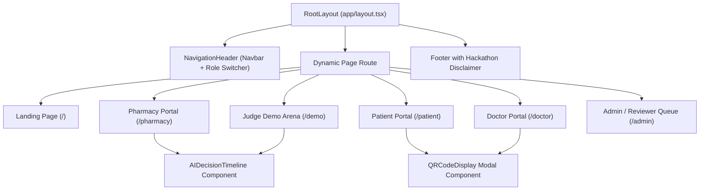

# 🖥️ MEDLOCK AI — Frontend Portals & UI Architecture Guide

This document details the user interface architecture, screen designs, interactive components, and role portals built in Next.js 14 and Tailwind CSS.

---

## 1. Frontend Technology Stack & Design System

- **Framework:** Next.js 14 (App Router, Server & Client Components)
- **Styling:** Tailwind CSS + Custom Emerald/Slate healthcare theme
- **Icons:** Lucide React
- **Aesthetic:** Clean clinical glassmorphism (`glass` backdrop blur), responsive grids, high-contrast badges, and real-time state steppers.
- **Port:** Runs locally on `http://localhost:3000`

---

## 2. Component Hierarchy & Navigation

---

## 3. Detailed Page Breakdown

### 1. Public Landing Page (`app/page.tsx`)
- **Hero Section:** Value proposition headline, live system telemetry counter (Prevented Over-Dispenses, Connected Pharmacies, Active Prescriptions, Pending Reviews).
- **The Problem vs Solution:** Side-by-side comparison illustrating legacy disconnected pharmacy vulnerabilities vs MedLock centralized ledger integrity.
- **5 Controlled Agents Breakdown:** Cards explaining Agents 1 through 5 and Gate 6.
- **Stakeholder Portal Links:** Direct navigation cards to Patient, Doctor, Pharmacy, and Admin portals.

---

### 2. Navigation Header & Demo Role Switcher (`components/dashboard/NavigationHeader.tsx`)
- **Sticky Glassmorphism Bar:** Brand logo, portal tabs, and real-time active user pill.
- **1-Click Role Switcher Dropdown:** Hackathon judges can instantly toggle between:
  - Patient (*Johnathan Doe*)
  - Doctor (*Dr. Arthur Vance, MD*)
  - Pharmacy (*HealthFirst Metro*)
  - Admin / Reviewer (*Dr. Eleanor Vance*)
  without logging in or logging out manually.

---

### 3. Patient Portal (`app/patient/page.tsx`)
- **Active Prescriptions List:** Card view for each active prescription with code, prescribing doctor, and clinic.
- **Remaining Quantity Progress Gauges:** Visual progress bars displaying `Remaining / Authorized` units with dynamic color coding (Green > 50%, Amber > 20%, Red $\le$ 20%).
- **Digital QR Presentation:** "Show Pharmacy QR" button triggers the `QRCodeDisplay` modal for presenting at pharmacy terminals.
- **Safety Warnings Banner:** High-visibility notices for held transactions or blocked attempts.
- **Central Dispensing History:** Cross-pharmacy transaction ledger table showing all participating pharmacies visited.

---

### 4. Doctor Portal (`app/doctor/page.tsx`)
- **Digital Prescription Creation Modal:**
  - Patient selector dropdown (populated with real patient records and DOBs).
  - Multi-medicine builder: Add one or more restricted drugs with authorized quantity limits and dosage instructions.
  - Validity period selector (default 30 days).
  - Clinical notes and instructions textarea.
  - Cryptographic digital signing on submission.
- **Issued Prescriptions Table:** View all doctor-issued prescriptions, expiry timestamps, and active statuses.
- **Revocation / Cancellation:** One-click "Revoke" button to cancel active prescriptions with instant audit trail recording.
- **QR Code Preview:** Instant modal to inspect generated verification QR codes.

---

### 5. Pharmacy Portal (`app/pharmacy/page.tsx`)
- **Prescription Lookup & Scanning:**
  - Manual text input or QR string input.
  - One-click presets for `Demo Rx 1`, `Demo Rx 2 (Over-Limit)`, and `Demo Rx 3 (Rapid Burst)`.
- **Branch Location Selector:** Switch between physical chain, independent, or online pharmacy locations to test cross-pharmacy actions.
- **Requested Quantity Input:** Specify tablets requested by the patient.
- **Dual Execution Modes:**
  1. *Run Multi-Agent Verification (Dry Run):* Evaluates the 5 agents and updates the AI Decision Timeline in real time without writing changes.
  2. *Finalize & Submit Dispense:* Commits the transaction, decrements the ledger balance atomically, and returns a verified receipt.
- **Live Decision Timeline Integration:** Embeds `AIDecisionTimeline` directly under the form.
- **Pharmacy Transaction Ledger:** Table showing recent local dispensing transactions.

---

### 6. Admin & Reviewer Portal (`app/admin/page.tsx`)
- **Triage Review Queue:** Filterable queue showing all cases placed `ON_HOLD` by Agent 4.
- **Pharmacist Triage Modal:**
  - Displays Agent 5's synthesized clinical briefing and key evidence.
  - Displays risk score, risk level, and contributing factors.
  - **Human-In-The-Loop Actions:**
    - `Approve Override` (authorizes release of held medication).
    - `Confirm Fraud` (suspends prescription network-wide).
    - `Dismiss` (dismisses flag).
  - Mandatory clinical justification notes field.
- **Cryptographic SHA-256 Audit Log Viewer:** Block-explorer style table displaying event types, actors, targets, timestamps, and verifiable SHA-256 hash chains.

---

### 7. Judge Demo Arena (`app/demo/page.tsx`)
- **Interactive Scenario Runner:** 1-click trigger cards for:
  - **Scenario 1:** Normal Authorized Purchase (`APPROVED`)
  - **Scenario 2:** Partial Refill at Different Pharmacy (`APPROVED`)
  - **Scenario 3:** Deterministic Over-Quantity Denial (`REJECTED`)
  - **Scenario 4:** Rapid Multi-Provider Activity Anomaly (`ON_HOLD`)
- **Instant Decision Timeline:** Visualizes the agent execution flow instantly upon clicking any scenario.
- **Raw JSON Inspector:** Toggleable drawer displaying the raw JSON payload produced by the Master Agent Orchestrator.
- **Reset Demo Database Button:** Clears and reseeds database with fresh test fixtures in 1 click.

---

## 4. Key Interactive UI Components

### 1. `AIDecisionTimeline.tsx`
Visualizes the 6 sequential evaluation steps:
- **Step 1:** Prescription Verification Agent (Status, Expiry, Doctor, Patient)
- **Step 2:** Dispensing Integrity Agent (Ledger Math: Authorized, Dispensed, Remaining, Requested)
- **Step 3:** Cross-Pharmacy Pattern Agent (Multi-provider velocity & channel switches)
- **Step 4:** Risk Assessment Engine (Calculated penalty points & risk score)
- **Step 5:** Review Summary Agent (LLM narrative briefing)
- **Step 6:** Central Decision Gate (Approved / Rejected / On Hold)

### 2. `QRCodeDisplay.tsx`
Renders a high-resolution Base64 PNG QR code inside an accessible modal containing prescription code, patient name, doctor name, and security verification badges.
