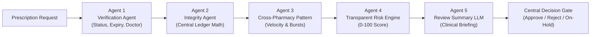

# 🛡️ MEDLOCK AI — Agentic Cross-Pharmacy Prescription Integrity System

> **A secure digital prescription and medicine-dispensing platform preventing cross-pharmacy over-dispensing through hard deterministic ledger rules, centralized dispensing history, and a multi-agent AI risk analysis pipeline with human-in-the-loop review.**

---

## 📌 The Core Problem

In traditional healthcare systems, pharmacies operate in disconnected data silos. A patient with a valid 30-tablet prescription can visit **Pharmacy A** (10 tablets), **Pharmacy B** (10 tablets), and **Online Pharmacy C** (20 tablets) in the same week, acquiring **40 tablets** when only 30 were legally authorized.

---

## 💡 The MedLock AI Solution

**MEDLOCK AI** introduces a centralized dispensing ledger powered by:
1. **Hard Deterministic Rules:** Mathematical enforcement of balance limits ($\text{Remaining} = \text{Authorized} - \sum \text{Dispensed}$). No LLM is ever allowed to calculate or authorize quantities.
2. **5-Agent AI Pipeline:** Real-time multi-pharmacy velocity tracking, rapid channel-switching detection, and grounded clinical summary generation.
3. **Human-in-the-Loop (HITL) Triage:** High-risk or anomalous requests trigger an `ON_HOLD` state and escalate to an authorized pharmacist review queue.
4. **Tamper-Evident SHA-256 Audit Chain:** Cryptographic hash chaining linking every transaction, cancellation, and override.

---

## 🤖 The 5 Controlled Agent Layers



- **Agent 1: Prescription Verification Agent** — Validates active status, expiry timestamp, physician licensing, and patient identity match.
- **Agent 2: Dispensing Integrity Agent** — Queries the central ledger, calculates remaining balance, and enforces hard limits.
- **Agent 3: Cross-Pharmacy Pattern Agent** — Scans 24h & 2h rolling windows for multi-provider velocity, online/physical alternation, and retry bursts after rejections.
- **Agent 4: Transparent Risk Engine** — Computes transparent, factor-weighted risk scores [0–100] categorized into `LOW`, `MEDIUM`, `HIGH`, or `CRITICAL`.
- **Agent 5: Review Summary Agent** — Uses grounded structured reasoning / LLM synthesis to draft clinical summaries for human reviewers.

---

## 👥 Stakeholder Portals

| Portal | Role | Key Features |
| :--- | :--- | :--- |
| **Patient Portal** | `PATIENT` | Real-time remaining quantity gauges, multi-pharmacy dispensing logs, QR code display, safety warning alerts. |
| **Doctor Portal** | `DOCTOR` | Multi-medicine prescription issuance, cryptographic signature generation, QR codes, prescription cancellation. |
| **Pharmacy Portal** | `PHARMACY` | QR scanner / code lookup, **Live AI Decision Timeline**, immediate receipt generation, balance decrement. |
| **Admin / Review Portal**| `ADMIN` | Triage queue for held transactions, AI clinical briefing viewer, human overrides, SHA-256 block explorer. |

---

## 🎬 4 Pre-Configured Demo Scenarios

| Scenario | Rx Code | Details | Expected Outcome |
| :--- | :--- | :--- | :--- |
| **Scenario 1: Normal Purchase** | `RX-2026-DEMO1` | Request 10 tabs at Metro Pharmacy (Authorized: 30, Dispensed: 0). | **`APPROVED`** (Rem: 20) |
| **Scenario 2: Cross-Pharmacy Refill** | `RX-2026-DEMO1` | Request 10 tabs at CarePlus Downtown *(Different pharmacy!)*. Central ledger enforces balance. | **`APPROVED`** (Rem: 10) |
| **Scenario 3: Over-Quantity Denial** | `RX-2026-DEMO2` | Sarah Jenkins requests 20 tabs of Oxycodone at CVS when only 10 remain. | **`REJECTED`** (Over-Limit) |
| **Scenario 4: Rapid Multi-Provider Burst** | `RX-2026-DEMO3` | David Miller attempts 4th purchase in 2 hours across physical & online pharmacies with prior rejection. | **`ON_HOLD` / Review** (Risk Score: 85) |

---

## 🛠️ Quickstart & Local Setup

### Prerequisites
- **Python 3.10+**
- **Node.js 18+** & **npm**

---

### Step 1: Start Backend API (FastAPI)

**From Project Root:**
```bash
# Install dependencies
pip install -r requirements.txt

# Run automated tests (7/7 tests)
python -m pytest -o pythonpath=backend backend/tests -v

# Start FastAPI server on port 8000
python backend/run.py
```

*Or from `backend/` directory:*
```bash
cd backend
pip install -r requirements.txt
python -m pytest tests -v
python run.py
```
> The backend boots on **`http://localhost:8000`** and automatically seeds 5 patients, 2 doctors, 5 pharmacies, and demo prescriptions.
> Interactive Swagger API Docs: **`http://localhost:8000/docs`**

---

### Step 2: Start Frontend Application (Next.js)

Open a new terminal window:
```bash
cd frontend

# Install dependencies (if not already done)
npm install

# Start Next.js development server on port 3000
npm run dev
```
> Open your browser at **`http://localhost:3000`**

---

## 🔑 Demo Login Credentials

You can use the **1-Click Demo Login** buttons on the Login page, or sign in manually with password `password123`:

- **Patient (Johnathan Doe):** `john.doe@patient.com`
- **Doctor (Dr. Arthur Vance, MD):** `doctor.vance@medlock.ai`
- **Pharmacy (HealthFirst Metro):** `metro@pharmacy.com`
- **Admin / Reviewer (Dr. Eleanor Vance):** `admin@medlock.ai`

---

## 🧪 Running Automated Tests

```bash
python -m pytest -o pythonpath=backend backend/tests -v
```

---

## ⚖️ Hackathon Disclaimer

*MEDLOCK AI is a hackathon prototype and proof-of-concept. It is not a replacement for certified medical, pharmacy, or legal oversight. High-risk decisions require authorized human review.*
