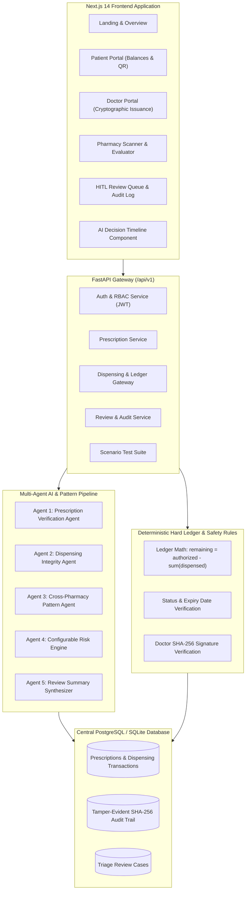

# MEDLOCK AI — System Architecture & Multi-Agent Specifications

## Executive Summary

**MEDLOCK AI** is a secure, cross-pharmacy digital prescription integrity system. It solves the vulnerability where disconnected physical and online pharmacies allow patients to repeatedly dispense restricted medicines beyond authorized quantities.

The core architecture strictly combines **Deterministic Hard Business & Ledger Rules** with an **Agentic AI Layer** and **Human-in-the-Loop (HITL)** triage.

---

## 1. High-Level System Architecture

---

## 2. The 5-Agent Layer Specification

### Agent 1: Prescription Verification Agent
- **Type:** Deterministic Validation
- **Responsibilities:**
  - Verify prescription existence by code or QR payload
  - Check expiration date vs current UTC timestamp
  - Ensure status is `ACTIVE`
  - Verify physician active license and verified standing
  - Confirm patient identity match
  - Confirm requested medicine code (NDC / RxNorm) exists on prescription

### Agent 2: Dispensing Integrity Agent
- **Type:** Deterministic Central Ledger Calculation
- **Responsibilities:**
  - Sum all approved and partially approved dispensing transactions across all network pharmacies
  - Calculate `remaining_quantity = authorized_quantity - total_dispensed_quantity`
  - Check `requested_quantity <= remaining_quantity`
  - **Zero LLM involvement:** Absolute mathematical guarantee against quantity hallucination.

### Agent 3: Cross-Pharmacy Pattern Agent
- **Type:** Heuristic Anomaly & Velocity Detection
- **Responsibilities:**
  - Rolling 24-hour and 2-hour window analysis
  - Distinct pharmacy counter (physical chains, independent, online)
  - Detect rapid provider switching (≥ 2 distinct pharmacies in < 2 hours)
  - Detect hybrid channel bursts (online pharmacy accessed in close proximity to physical)
  - Detect repeated purchase attempts following recent rejections (< 30 min)

### Agent 4: Configurable Risk Assessment Engine
- **Type:** Transparent Scored Risk Engine (0 to 100)
- **Scoring Weights:**
  - Quantity exceeds remaining limit: `+25`
  - Rapid provider switching (< 2 hours): `+25`
  - Multi-provider spike (≥ 3 pharmacies in 24h): `+20`
  - High rejection frequency (≥ 1 rejection in 48h): `+20`
  - Immediate retry within 30 min of denial: `+30`
  - Online + physical channel switching: `+15`
- **Risk Tiers:**
  - `0 - 24`: **LOW** (Fast-track Approved)
  - `25 - 49`: **MEDIUM** (Approved with audit log flag)
  - `50 - 74`: **HIGH** (Placed `ON_HOLD`, pharmacist review case generated)
  - `75 - 100`: **CRITICAL** (Automated dispensing restricted, escalated to Reviewer Queue)

### Agent 5: Review Summary Agent
- **Type:** Grounded LLM / Clinical Synthesis Engine
- **Responsibilities:**
  - Takes structured outputs from Agents 1–4
  - Formulates a natural language clinical briefing for human pharmacists
  - Strictly anchored to deterministic evidence to prevent hallucination
  - Never makes authorization decisions independently.

---

## 3. Cryptographic Tamper-Evident Audit Logging

Every crucial transaction, cancellation, hold, and human override generates an audit entry linked to the previous log entry via SHA-256 hash chaining:

$$\text{BlockHash}_n = \text{SHA-256}(\text{BlockHash}_{n-1} \parallel \text{Timestamp} \parallel \text{EventType} \parallel \text{ActorID} \parallel \text{TargetID} \parallel \text{PayloadJSON})$$

This creates a tamper-evident chain preventing retrospective alterations to dispensing history.
